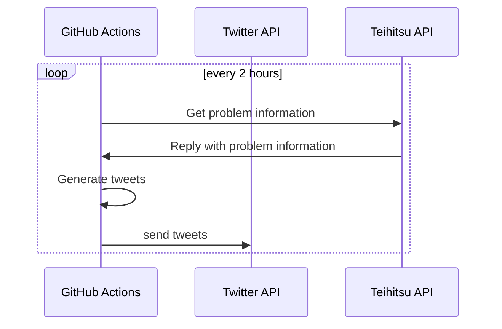

# Teihitsu Training Automated Twitter Account

An automated quiz-type account with a poll function. It is positioned as a Twitter client service for _Teihitsu Training_.

### Features

- Interactive learning through a voting function

> **Note**
> 
> At this time, the only type of question is **Ateji/Jyukujikun (当て字・熟字訓)**.

## Resources

### Email address

The email address attached to the automated account:

[Email address](<mailto:yudukikun5120+TeihitsuTRNG@gmail.com>)

### Twitter account

- [https://www.twitter.com/teihitsuTRNG](https://www.twitter.com/teihitsuTRNG)

### Credentials 

> **Warning**
> 
> For keys and tokens, this shall be managed by @yudukikun5120.

## Development

### Reference

- https://github.com/julianfssen/tweetkit
- https://github.com/bkeepers/dotenv
- [Twitter Developer](https://developer.twitter.com/en/portal/projects/1498377454074826754/apps/23522909/settings)
- [Twitter API Docs](https://developer.twitter.com/en/docs/twitter-api)

### Sequence diagram

